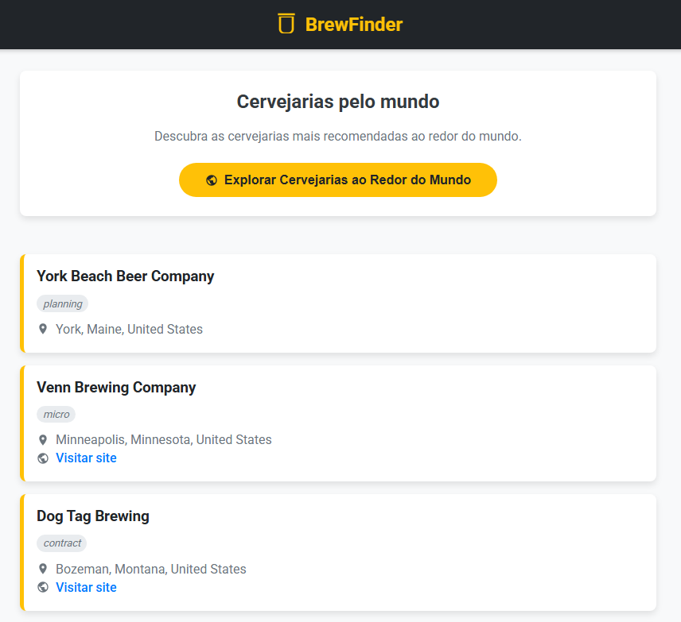
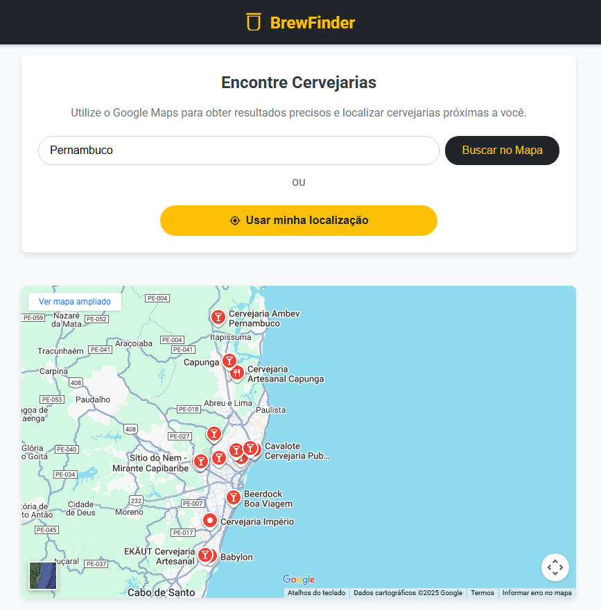
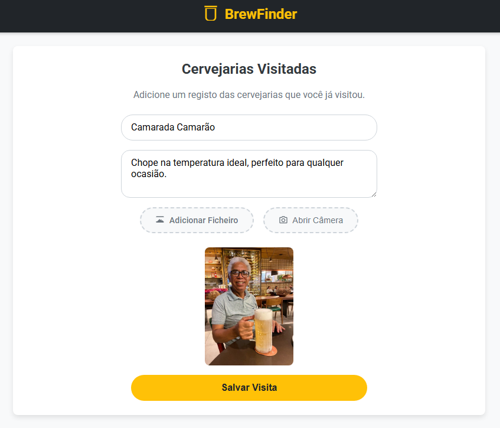

# 🍺 BrewFinder PWA

> Um Progressive Web App (PWA) criado para ajudar amantes de cerveja a encontrar, descobrir e registrar suas visitas a cervejarias, seja na sua cidade ou ao redor do mundo.

[](https://brewfinderpwa.netlify.app/)

### Prévia do Projeto

<p align="center">
  
  
  
</p>

**[Clique aqui para acessar o App e encontrar sua próxima cervejaria!](https://brewfinderpwa.netlify.app/)**

---

## 📜 Sobre o Projeto

O BrewFinder nasceu como um projeto prático para explorar o poder dos Progressive Web Apps (PWAs). O objetivo era criar uma aplicação web que oferecesse uma experiência de usuário próxima a de um aplicativo nativo: rápida, instalável, funcional e capaz de interagir com o hardware do dispositivo, como a câmera.

O projeto integra diversas tecnologias de front-end modernas para resolver um problema simples e divertido: como encontrar, descobrir e guardar recordações de cervejarias de forma fácil e intuitiva.

---

## ✨ Funcionalidades Principais

-   **Busca Geográfica Precisa:** Utiliza a **API do Google Maps** para permitir que os usuários pesquisem cervejarias em qualquer cidade do mundo.
-   **Encontre Perto de Mim:** Com um único clique, usa a **Geolocation API** do navegador para encontrar cervejarias próximas à localização atual do usuário.
-   **Descubra Cervejarias pelo Mundo:** Consome a API pública **Open Brewery DB** para listar cervejarias famosas e permitir a descoberta de novos locais.
-   **Diário de Cervejarias Visitadas:** Permite ao usuário registrar uma visita, tirar uma foto do local usando a câmera do dispositivo e salvar a recordação.
-   **Design Responsivo:** A interface se adapta perfeitamente a qualquer tamanho de tela, de desktops a celulares.
-   **Capacidades PWA:**
    -   **Instalável:** Pode ser adicionado à tela inicial do celular ou desktop.
    -   **Manifesto Web App:** Possui ícones, cores de tema e uma tela de splash para uma experiência imersiva.
    -   **Service Worker:** Permite o funcionamento básico offline através de cache.

---

## 🚀 Tecnologias Utilizadas

-   **Linguagens:** HTML5, CSS3, JavaScript
-   **APIs e Bibliotecas:**
    -   [Google Maps API](https://developers.google.com/maps): Para visualização de mapas e busca de locais.
    -   [Open Brewery DB API](https://www.openbrewerydb.org/): Para obter a lista de cervejarias ao redor do mundo.
    -   Geolocation API: Para obter a localização do usuário.
    -   MediaDevices (getUserMedia) API: Para acesso à câmera do dispositivo.
-   **PWA:**
    -   Web App Manifest
    -   Service Worker

---

## 🎮 Como Usar

1.  **Para encontrar cervejarias:**
    -   Use a busca por cidade ou o botão "Usar minha localização" para encontrar locais no mapa.
2.  **Para descobrir novas cervejarias:**
    -   Acesse a aba "Recomendadas" para ver uma lista de cervejarias populares.
3.  **Para registrar uma visita:**
    -   Na página de uma cervejaria, clique em "Registrar Visita".
    -   Tire uma foto, adicione um comentário e salve para ver na sua lista de "Visitadas".

---

## 💻 Como Executar o Projeto Localmente

Para rodar este projeto na sua máquina, siga os passos abaixo:

1.  **Clone o repositório:**
    ```bash
    git clone https://github.com/jmtmds/BrewFinder-PWA.git
    ```
2.  **Navegue até a pasta do projeto:**
    ```bash
    cd BrewFinder-PWA
    ```
3.  **Adicione sua chave da API do Google Maps:**
    -   No arquivo `index.html` (ou onde você faz a chamada), encontre a linha do script do Google Maps e substitua `SUA_CHAVE_API` pela sua chave pessoal.
4.  **Inicie um servidor local:**
    -   A maneira mais fácil é usando a extensão **"Live Server"** no Visual Studio Code. Clique com o botão direito no arquivo `index.html` e escolha "Open with Live Server".
    -   *Observação: O acesso à câmera e à geolocalização exige um contexto seguro (HTTPS ou `localhost`).*

---

## 📄 Licença

Este projeto está sob a licença MIT. Veja o arquivo `LICENSE` para mais detalhes.

---

_Desenvolvido com 💛 por João Marcos Tavares._
